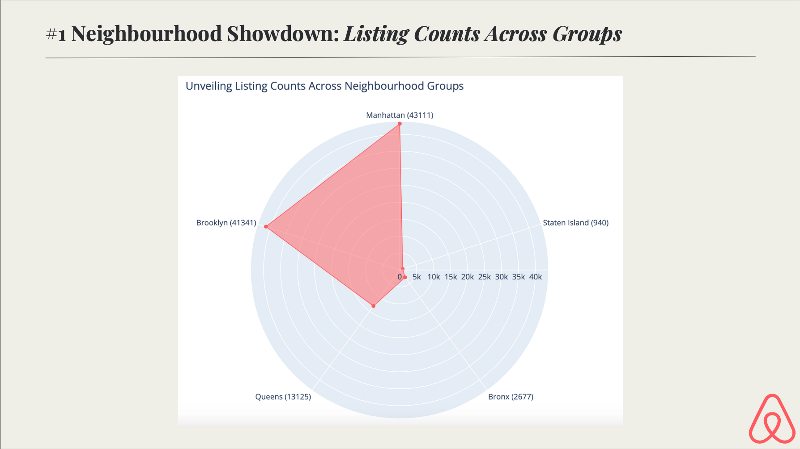
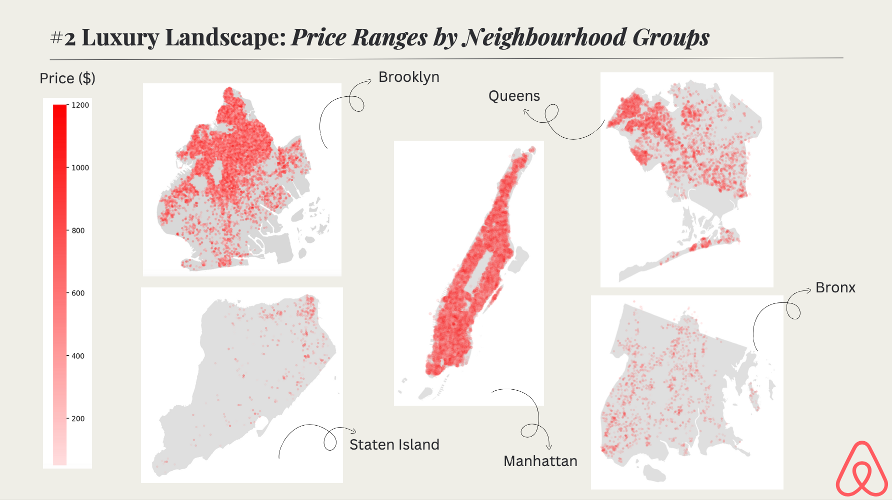
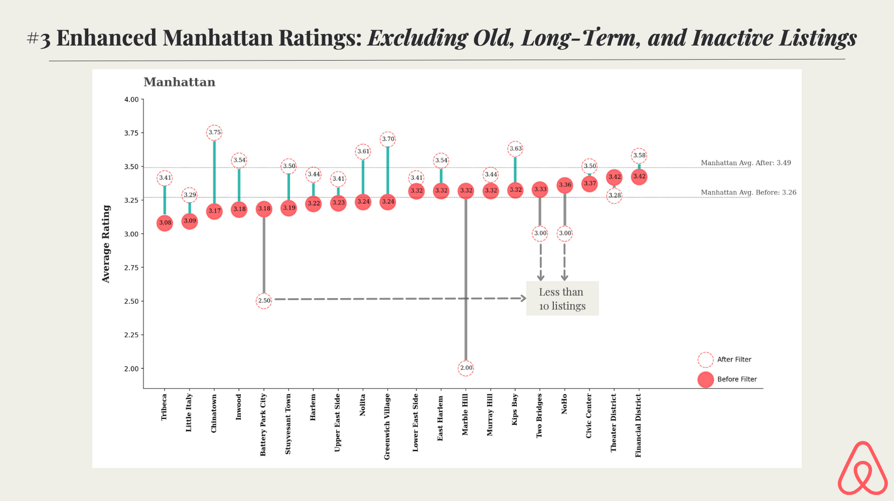
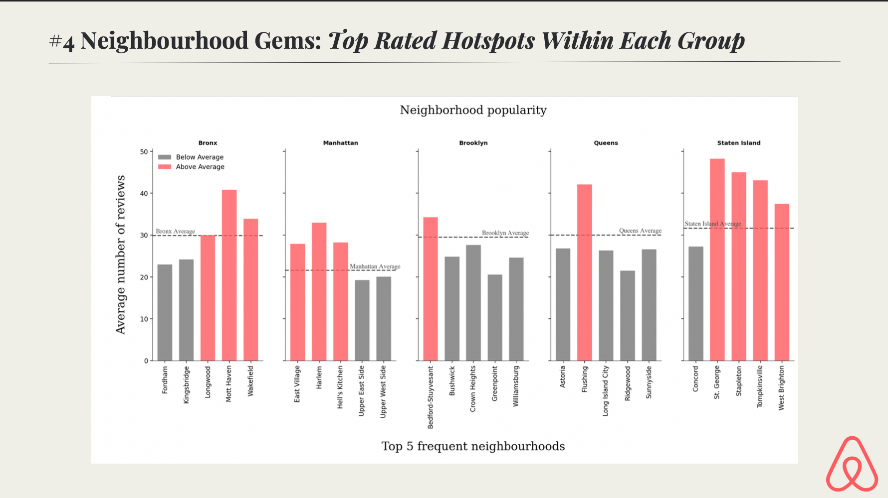
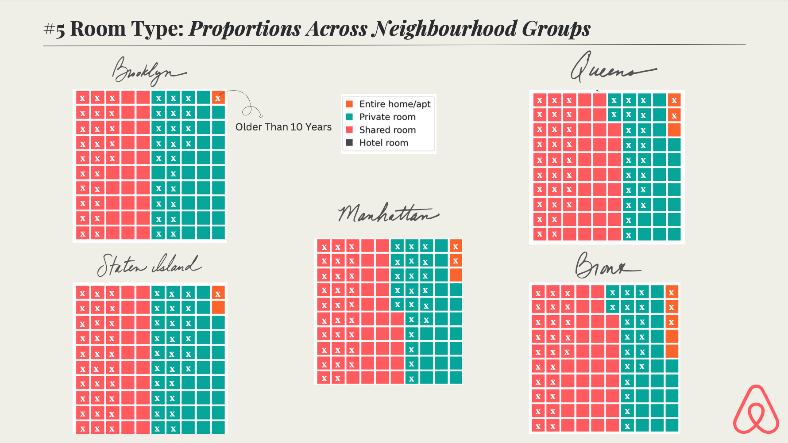
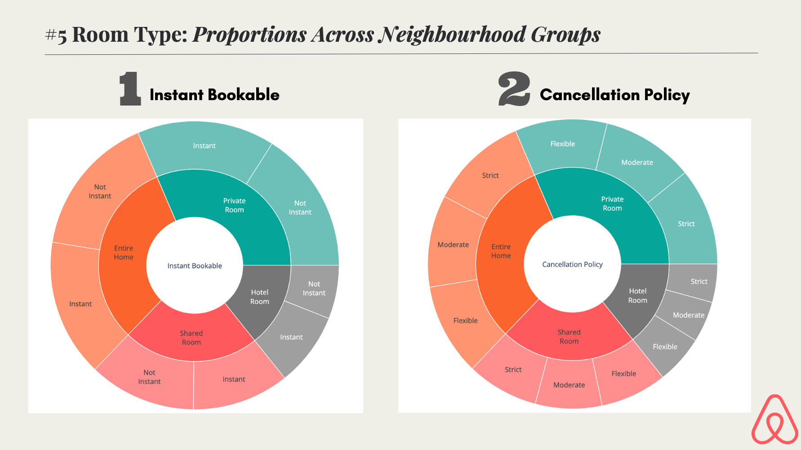
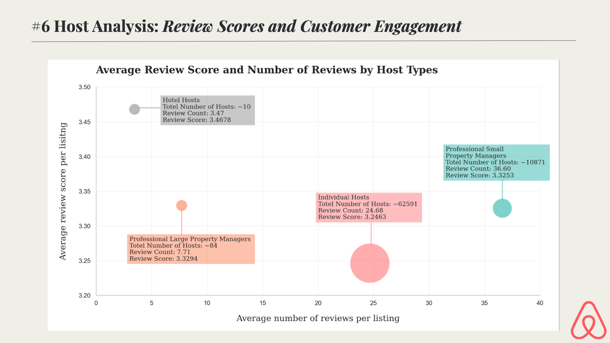

# Airbnb Voyager

## Project Overview:
Welcome to Airbnb Voyager - an exploratory journey through data visualization!
By - Bhumika Srinivas, <a href="https://github.com/eren-bardak">Eren Bardak</a>
, <a href="https://github.com/sissi-shen">Sissi Shen</a>

## About
Airbnb Voyager is a project dedicated to uncovering insightful patterns and trends within Airbnb data through Exploratory Data Analysis (EDA) and engaging visualizations. Whether you're an Airbnb enthusiast, a data enthusiast, or both, this project aims to provide a captivating exploration of the Airbnb landscape.

**Dataset:**
https://www.kaggle.com/datasets/arianazmoudeh/airbnbopendata

## Key Insights

